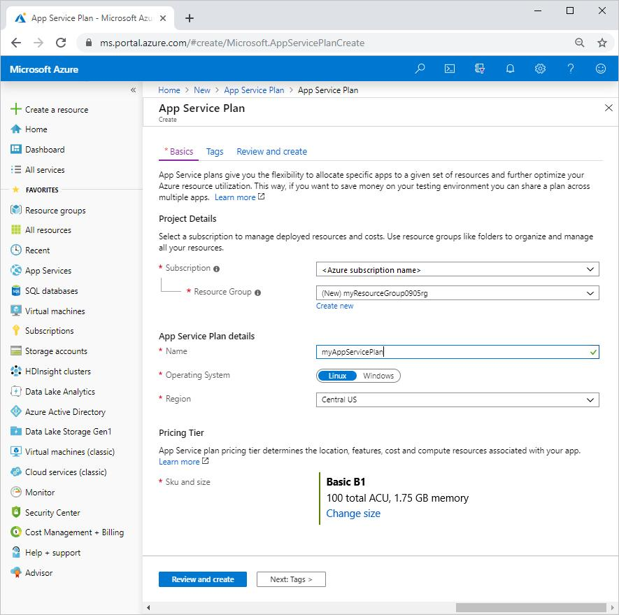
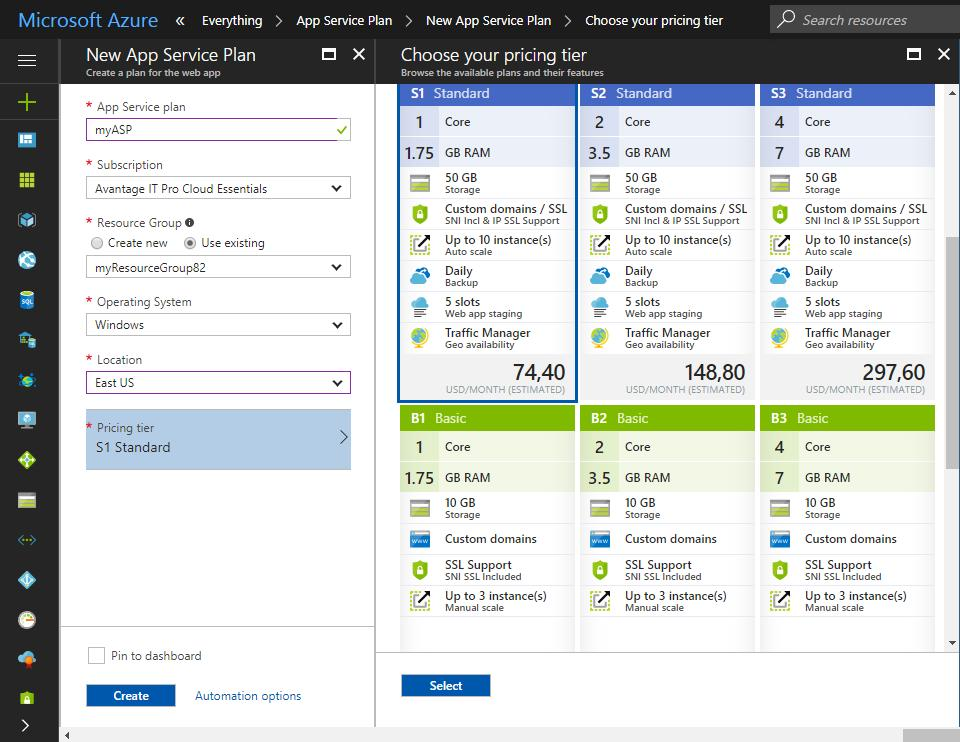
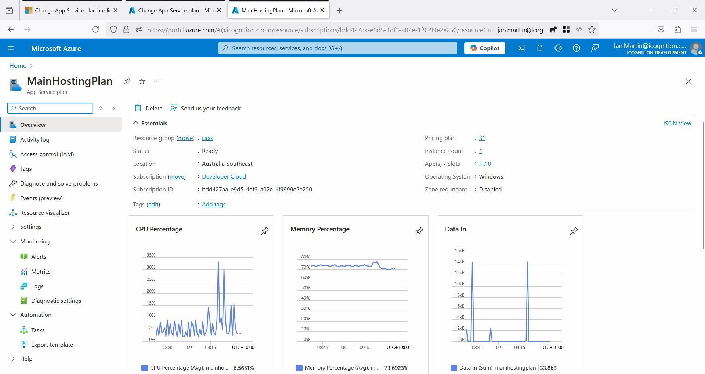
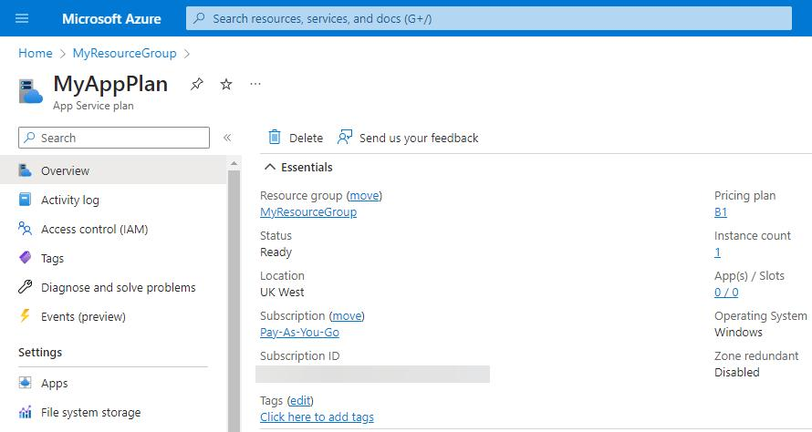

# Azure App Service Plan - Complete Guide

---

# Overview

One of the most commonly misunderstood concepts in Azure is the difference between:

```text
App Service
```

and

```text
App Service Plan
```

Understanding this difference is important for interviews and real-world Azure projects.

---

# What is an App Service?

An App Service is your application.

Examples:

```text
Employee API
Customer API
Payment API
Notification API
```

These applications are deployed to Azure App Service.

---

# What is an App Service Plan?

An App Service Plan provides the infrastructure resources required to run App Services.

It provides:

- CPU
- Memory (RAM)
- Storage
- Compute Resources

Think of it as the machine that runs your applications.

---

# Simple Analogy

Imagine an apartment building.

```text
Apartment Building
      |
      +--> Electricity
      +--> Water
      +--> Security
      +--> Maintenance
```

This is:

```text
App Service Plan
```

Apartments inside the building:

```text
Apartment 101
Apartment 102
Apartment 103
```

These are:

```text
App Services
```

---

# Relationship

```text
App Service Plan
        |
        +--> Employee API
        +--> Customer API
        +--> Payment API
```

Multiple applications can run inside a single App Service Plan.

---

# Real World Example

Suppose we create:

```text
App Service Plan

Name:
Employee-Plan

CPU:
2 Core

RAM:
4 GB
```

Inside this plan we deploy:

```text
Employee API
Customer API
Notification API
```

All applications share the resources of the plan.

---

# Azure Architecture

```text
Internet
    |
    v
Employee API
    |
    v
App Service
    |
    v
App Service Plan
    |
    +--> CPU
    +--> RAM
    +--> Storage
```

---

# Why Do We Need App Service Plan?

Applications need resources to run.

Without a plan:

```text
App Service
      |
      +--> No CPU
      +--> No RAM
```

Application cannot execute.

The App Service Plan provides the infrastructure.

---

# Azure Portal Example

When creating an App Service:

```text
Create App Service
      |
      +--> App Service Plan
```

Azure asks:

```text
Create New Plan

or

Use Existing Plan
```

Every App Service must belong to an App Service Plan.

---

# Resource Sharing

One App Service Plan can host multiple applications.

Example:

```text
Employee-Plan

CPU = 4 Core
RAM = 8 GB

--------------------------------

Employee API

Customer API

Payment API

Notification API
```

All applications share the plan's resources.

---

# App Service vs App Service Plan

## App Service

Contains:

```text
Application Code
Controllers
Services
Repositories
Business Logic
```

Example:

```text
Employee API
```

---

## App Service Plan

Contains:

```text
CPU
RAM
Storage
Pricing Tier
```

Example:

```text
P1V3 Plan
```

---

# Easy Interview Explanation

```text
App Service
      =
Application

App Service Plan
      =
Machine Running Application
```

---

# Scaling in Azure

Scaling occurs at the App Service Plan level.

---

# Vertical Scaling (Scale Up)

Increase machine power.

Example:

```text
Current

2 CPU
4 GB RAM

-----------------

Scale Up

4 CPU
8 GB RAM
```

Azure replaces the machine with a larger one.

---

# Horizontal Scaling (Scale Out)

Increase instance count.

Example:

```text
1 Instance
     |
5 Instances
```

Azure creates multiple copies of the application.

---

# Scale Out Architecture

```text
Users
   |
   v
Azure Load Balancer
   |
   +--> Instance 1
   +--> Instance 2
   +--> Instance 3
   +--> Instance 4
   +--> Instance 5
```

Traffic is distributed automatically.

---

# Pricing

Billing is based on:

```text
App Service Plan
```

Not the App Service itself.

Example:

```text
Plan:
4 CPU
8 GB RAM

Monthly Cost:
Depends on Plan Tier
```

Applications inside the plan use the purchased resources.

---

# Common Pricing Tiers

## Free

```text
F1
```

Used for learning.

---

## Shared

```text
D1
```

Low-cost development.

---

## Basic

```text
B1
B2
B3
```

Small production workloads.

---

## Standard

```text
S1
S2
S3
```

Supports autoscaling.

---

## Premium

```text
P1V3
P2V3
P3V3
```

Enterprise production workloads.

---

# Example Enterprise Setup

```text
Employee-Plan

CPU: 8 Core
RAM: 16 GB

--------------------------------

Employee API

Customer API

Payment API

Notification API
```

All applications run inside the same App Service Plan.

---

# Important Interview Questions

## What is an App Service Plan?

An App Service Plan defines the compute resources such as CPU, memory, storage, operating system, and pricing tier used by one or more App Services.

---

## Can multiple App Services use the same App Service Plan?

Yes.

Multiple applications can share a single App Service Plan.

---

## Where does scaling occur?

Scaling occurs at the App Service Plan level.

---

## What is the difference between App Service and App Service Plan?

App Service:

```text
Application
```

App Service Plan:

```text
Infrastructure Resources
```

---

## What determines App Service pricing?

The selected App Service Plan tier determines pricing.

---

# Real Enterprise Example

```text
Employee API
Customer API
Payment API

       |
       v

Azure App Service Plan

CPU: 8 Core
RAM: 16 GB

       |
       v

Managed by Azure
```

Applications share the resources provided by the plan.

---

# Key Interview Answer

Azure App Service is the application hosting service, while an App Service Plan provides the underlying infrastructure resources such as CPU, memory, storage, and pricing tier. Multiple App Services can run within a single App Service Plan and share its resources. Scaling operations such as scale-up and scale-out are performed at the App Service Plan level.

1. Create App Service Plan





2. App Service Plan Overview



