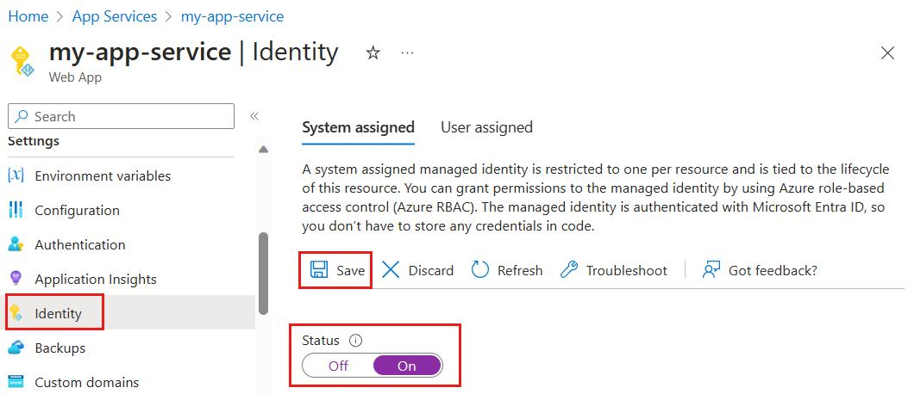
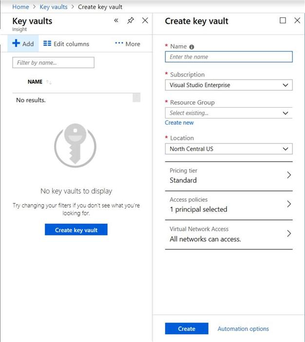
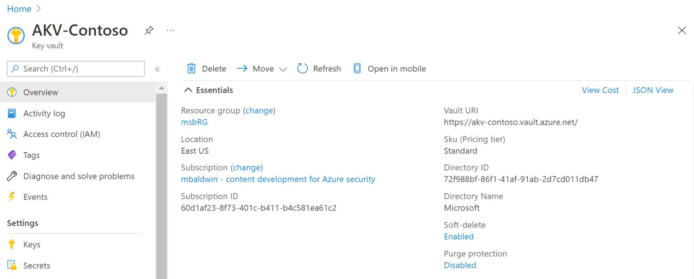
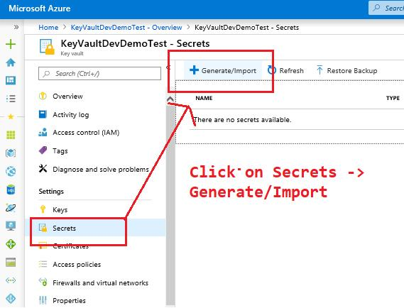
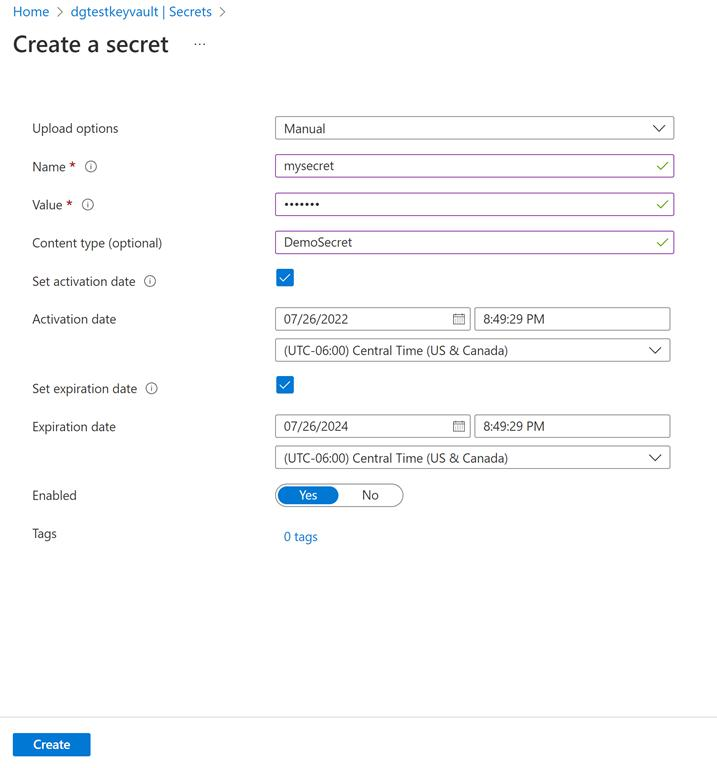
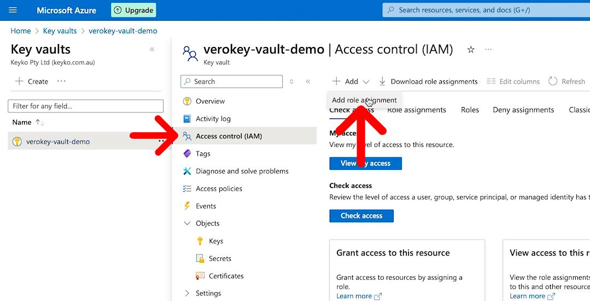
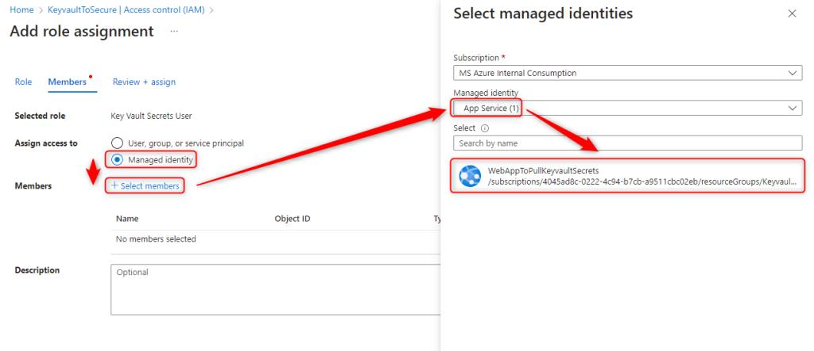
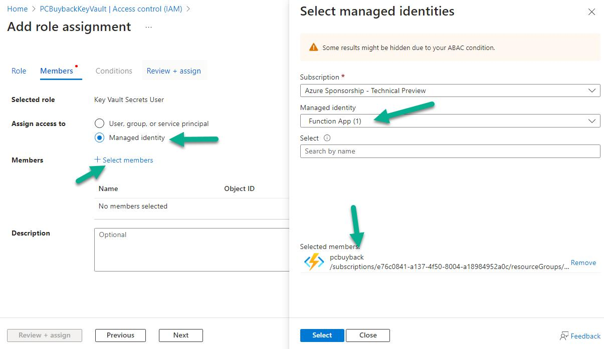

# Azure Key Vault, Managed Identity & IAM - Complete Interview Notes

---

# 1. What is Azure Key Vault?

Azure Key Vault is a cloud service used to securely store and manage:

- Secrets
- Passwords
- API Keys
- Connection Strings
- Certificates
- Encryption Keys

Instead of storing sensitive information inside code or appsettings.json, we store them in Azure Key Vault.

---

## Bad Practice

```json
{
  "ConnectionStrings": {
    "DefaultConnection": "Server=sql;Database=EmployeeDB;User=admin;Password=123456"
  }
}
```

Problems:

- Password exposed
- Source control risk
- Security vulnerability

---

## Good Practice

Store secrets in Key Vault.

```text
Azure Key Vault

DbConnectionString
OpenAIApiKey
RedisConnectionString
StorageAccountKey
```

Application retrieves secrets securely at runtime.

---

# 2. Why Do We Need Key Vault?

Without Key Vault:

```text
Application
    |
    +--> Password stored in code
```

With Key Vault:

```text
Application
    |
    +--> Azure Key Vault
               |
               +--> Secrets
```

Benefits:

- Centralized secret management
- Secret rotation
- Auditing
- Encryption
- Secure access

---

# 3. What is Managed Identity?

Managed Identity is an Azure feature that creates an identity for Azure resources.

Examples:

- App Service
- Azure Function
- Virtual Machine
- AKS
- Logic Apps

This identity can authenticate with Azure services without storing credentials.

---

## Interview Definition

Managed Identity is an automatically managed identity provided by Azure that allows applications to securely access Azure resources without storing usernames, passwords, client IDs, or client secrets.

---

# 4. Why Managed Identity?

Without Managed Identity:

Application needs:

```text
ClientId
ClientSecret
TenantId
```

Example:

```csharp
var clientId = "...";
var clientSecret = "...";
```

Problems:

- Secret management
- Secret expiration
- Security risks

---

With Managed Identity:

```text
No Username
No Password
No Client Secret
```

Azure handles authentication automatically.

---

# 5. Real Life Analogy

Imagine an office building.

Employee has:

```text
Employee Badge
```

Badge proves identity.

Similarly:

```text
Managed Identity
```

proves application identity.

---

# 6. What Happens When Identity is ON?

Azure Portal:

```text
App Service
   |
   +--> Identity
          |
          +--> System Assigned
                   |
                   +--> ON
```

Azure creates:

```text
Identity ID = 12345
```

for the App Service.

This is called a Managed Identity.

---

# Important

Turning ON Managed Identity:

```text
Creates Identity
```

It DOES NOT:

```text
Grant Permissions
```

Many beginners confuse these two concepts.

---

# 7. What is IAM?

IAM = Identity and Access Management

IAM controls:

1. Who are you?
2. What can you access?

---

## Identity

```text
Managed Identity
ID = 12345
```

---

## Access

```text
Can Read Key Vault Secrets
```

---

Together:

```text
Identity + Permissions = IAM
```

---

# Real Life Example

Employee Badge:

```text
Identity
```

Access to Server Room:

```text
Permission
```

Both together:

```text
IAM
```

---

# 8. Why IAM is Required?

Having an identity alone is not enough.

Example:

```text
Employee ID = 12345
```

But security asks:

```text
Is employee 12345 allowed?
```

Permission must exist.

IAM stores those permissions.

---

# 9. Key Vault IAM Configuration

Go to:

```text
Key Vault
    |
    +--> Access Control (IAM)
            |
            +--> Add Role Assignment
```

Assign role:

```text
Key Vault Secrets User
```

To:

```text
App Service Managed Identity
```

Now Key Vault trusts that application.

---

# 10. Understanding Roles

Role = Permission Set

Examples:

| Role | Permission |
|--------|------------|
| Reader | View Resources |
| Contributor | Create/Update/Delete |
| Owner | Full Access |
| Key Vault Secrets User | Read Secrets |
| Key Vault Administrator | Manage Key Vault |

---

# 11. Complete Architecture

```text
ASP.NET Core API
        |
        |
Managed Identity
        |
        |
Azure Key Vault
        |
        +--> DbConnectionString
        +--> OpenAIApiKey
        +--> RedisConnectionString
```

---

# 12. Runtime Flow

Application starts:

```text
EmployeeAPI
```

Identity exists:

```text
Managed Identity = 12345
```

Code executes:

```csharp
new DefaultAzureCredential();
```

Azure:

```text
Find Managed Identity
```

Generates access token.

Sends token to Key Vault.

Key Vault checks:

```text
Does Identity 12345 have permission?
```

IAM says:

```text
YES
```

Secret returned.

---

# 13. Visual Flow

```text
Step 1

App Service
    |
    +--> Managed Identity Created
            ID = 12345

----------------------------------

Step 2

Key Vault IAM
    |
    +--> Key Vault Secrets User
            |
            +--> Assign to 12345

----------------------------------

Step 3

Application Starts
        |
        +--> DefaultAzureCredential()
                 |
                 +--> Managed Identity Token
                         |
                         +--> Key Vault

----------------------------------

Step 4

Key Vault Checks IAM
        |
        +--> Allowed

----------------------------------

Step 5

Secret Returned
```

---

# 14. DefaultAzureCredential()

Most commonly used authentication class.

```csharp
new DefaultAzureCredential()
```

It automatically chooses the best authentication method.

Checks:

```text
1. Environment Variables
2. Visual Studio Login
3. Azure CLI Login
4. Managed Identity
```

---

# 15. Reading Secrets from Key Vault

Program.cs

```csharp
using Azure.Identity;

builder.Configuration.AddAzureKeyVault(
    new Uri("https://myvault.vault.azure.net/"),
    new DefaultAzureCredential());
```

---

Retrieve Secret

```csharp
string connectionString =
    builder.Configuration["DbConnectionString"];
```

---

# 16. EF Core Example

```csharp
builder.Services.AddDbContext<AppDbContext>(options =>
{
    options.UseSqlServer(
        builder.Configuration["DbConnectionString"]);
});
```

---

# 17. OpenAI Example

Store:

```text
OpenAIApiKey
```

Read:

```csharp
var apiKey =
    builder.Configuration["OpenAIApiKey"];
```

Use:

```csharp
var client =
    new OpenAIClient(apiKey);
```

---

# 18. Interview Questions

## What is Azure Key Vault?

Azure Key Vault is a secure Azure service used to store and manage secrets, passwords, certificates, encryption keys, and connection strings.

---

## What is Managed Identity?

Managed Identity is an Azure-managed identity assigned to an Azure resource that enables secure authentication without storing credentials.

---

## What is IAM?

IAM stands for Identity and Access Management.

It controls:

- Who can access resources
- What actions they can perform

---

## Why Managed Identity?

Benefits:

- No passwords
- No client secrets
- Automatic token management
- Improved security

---

## Difference Between Managed Identity and IAM

Managed Identity:

```text
Who am I?
```

IAM:

```text
What am I allowed to do?
```

---

## Most Important Interview Statement

Managed Identity creates an identity for an Azure resource, while IAM grants permissions to that identity. Together they allow secure access to Azure services such as Key Vault without storing credentials in code.


Step 1: Create Key Vault



Step 2: Open Key Vault


Step 3: Add Connection String Secret



Step 4: Give Permission to EmployeeAPI

Step 5: Select Role


